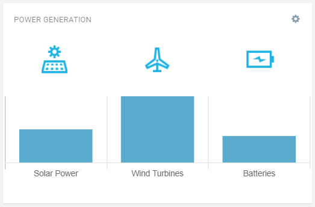

# Bar Chart Widget for Cumulocity IoT

This is a runtime bar chart widget. It allows you to define multiple datapoints as constant (fixed) values or actual measurement values in realtime from Device or Device Groups. In addition, you can add custom icon respective to each datapoint.

### Installation - for the dashboards using Application Builder
1. Download the latest `c8y-barchart-widget-{version}.zip` file from the Releases section.
2. Make sure you have Application Builder installed.
3. Open a dashboard.
4. Click `more...`.
5. Select `Install Widget` and follow the instructions.

### Configuration - to view the Bar Chart widget
1. Make sure you have successfully installed the widget.
2. Click on `Add widget`.
3. Choose `Bar chart` widget.
4. `Title` is the title of widget. Provide a relevant name. You may choose to hide this. Go to `Appearance` tab and choose `Hidden` under `Widget header style`.
5. `Delete datapoint` allows you to delete a datapoint.
6. `Label` is the name of the datapoint that will appear on the x-axis.
7. `Icon` is for the icon you want to show on the top of the datapoint.
8. `Value type` allows to you choose whether datapoint will have a `Constant` value or a `Measurement` value from a Device or a Device Group.
9. `Value type` is `Constant`.
    1. `Value` allows you provide a fixed value (numerical) for the datapoint.
10. `Value type` is `Measurement`.
    1. `Select device/ device group` allows you to choose a Device or Device Group.
    2. `Select fragment series` allows you to choose a `Fragment` and `Series` combined. It automatically gets populated based on the device or device group selected.
11. `Color` allows you choose a color specific for the bar.
12. `Add new datapoint` allows you to define additional datapoints.
13. Click `Save` to add the widget on the dashboard.
14. In case you see unexpected results on the widget, refer to browser console to see if there are error logs.

### Development - to do the enhancements and testing locally
1. Clone the repository on local machine using `git clone https://github.com/SoftwareAG/cumulocity-barchart-widget.git`.
2. Run `npm install` to download the module dependencies.
3. Install c8ycli `npm install -g @c8y/cli` if not already.
4. Run `c8ycli server -u https://your_tenant_url` to start the server.
5. Go to `http://localhost:9000/apps/cockpit/` in the browser to view and test your changes.
6. (Optional) push the changes back to this repository.

### Build - to create a new build for the Runtime Widget Loader
1. Finish the development and testing on your local machine.
2. Run `gulp` to start the build process. Run `npm install -g gulp` to install gulp if not already.
3. Use `c8y-barchart-widget-{version}.zip` file in the `dist` folder as a distribution.

------------------------------

These tools are provided as-is and without warranty or support. They do not constitute part of the Software AG product suite. Users are free to use, fork and modify them, subject to the license agreement. While Software AG welcomes contributions, we cannot guarantee to include every contribution in the master project.

------------------------------

For more information you can Ask a Question in the [TECHcommunity Forums](http://tech.forums.softwareag.com/techjforum/forums/list.page?product=cumulocity).
  
  
You can find additional information in the [Software AG TECHcommunity](http://techcommunity.softwareag.com/home/-/product/name/cumulocity).